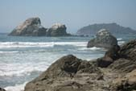
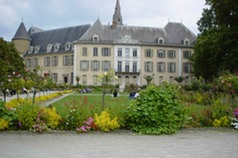
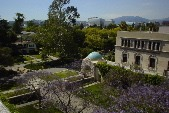
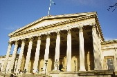
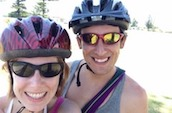
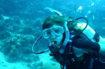
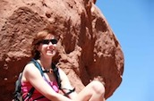
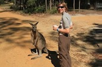

{:style="float: left;margin-right: 7px;:class="img-responsive"}
{:style="float: left;margin-right: 7px;:class="img-responsive"}
{:style="float: left;margin-right: 7px;:class="img-responsive"}
{:class="img-responsive"}

I grew up in **Humboldt County, California**, a beautiful rural area of northern California in heart of the redwoods. After high school, I spent a year as a Rotary exchange student in **Grenoble, France**, a beautiful town in the middle of the French Alps. I returned to the U.S. to attend Caltech (the California Institute of Technology) in **Pasadena, California**, where I obtained a degree in planetary science. I next found myself in **London, England**, first as an exchange student and then again for six months after graduation. After a brief stint in **Washington, D.C.** exploring the world of science policy, I headed to **Cambridge, Massachusetts** to complete my PhD in atmospheric chemistry at Harvard University.

I moved to Australia in 2012, and spent more than a decade living in the beautiful coastal city of **Wollongong, NSW** (80 km south of Sydney). I initially moved for a postdoctoral position and then transitioned into an academic teaching and research role at the University of Wollongong. I also spent 3.5 years as an Associate Dean (Equity, Diversity and Inclusion) at the University of Wollongong. In 2024, I adventured into government, spending a year as an Australian Science Policy Fellow working for the Commonwealth (federal) Department of Industry, Science and Resources.

I now live in the beautiful tropical city of **Townsville, Queensland** (80 km south of Sydney). Fun fact: at 19°S, Townsville is closer to the equator than Honolulu! I am a Professor of Environmental Science and Associate Dean Learning and Teaching for the College of Science and Engineering at James Cook University. Outside of work, I am most likely to be found training for triathlons, scuba diving, hiking, exploring Australia, and discovering new places.

{:style="float: left;margin-right: 7px;:class="img-responsive"}
{:style="float: left;margin-right: 7px;:class="img-responsive"}
{:style="float: left;margin-right: 7px;:class="img-responsive"}
{:class="img-responsive"}
