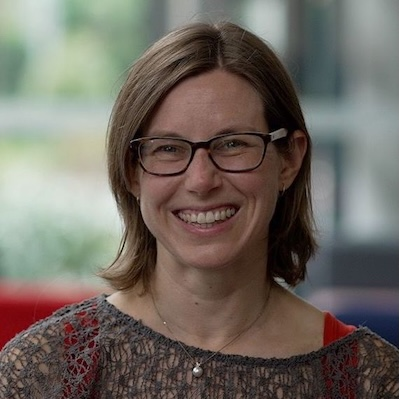

{:style="float: left;margin-right: 7px;:class="img-responsive"}
### Associate Dean Learning & Teaching
#### [College of Science and Engineering](https://www.jcu.edu.au/college-of-science-and-engineering)
#### [James Cook University](https://www.jcu.edu.au)

### Honorary Professor
#### [Environmental Futures](https://www.uow.edu.au/science-medicine-health/research/environmental-futures/) 
#### [University of Wollongong](https://www.uow.edu.au/)

 <!--Room G19, Building 41, Northfields Avenue  -->
 <!--Wollongong, NSW 2522, Australia  -->
 <!--P: +61 2 4221 5484  -->
 <!--E: jennyf [at] uow.edu.au -->

### Research Overview
My research centres on investigating the sources, chemical evolution, and transport pathways of atmospheric pollution. I use a global chemical transport model combined with observational data sets (ground-based, aircraft, and satellite) to increase our fundamental understanding of the impacts of human activity and natural processes on atmospheric composition in diverse environments. [[CV]](pdfs/CV_web.pdf) [[ORCiD]](http://orcid.org/0000-0002-2921-1691) [[UOW Scholars]](https://scholars.uow.edu.au/display/jenny_fisher)

### Teaching Overview
I teach earth systems science and introductory programming to undergraduate students. For more details, including my teaching philosophy, please see my [teaching portfolio](https://sites.google.com/view/jfisher-teaching-portfolio/home). To access the Jupyter notebooks I use for teaching Python, please see my [teaching Github page](https://jennyfisher.github.io/computing-modelling-earthsci/).

### News
- As of January 2025, I have started a new position as Associate Dean Learning and Teaching in the College of Science and Engineering at James Cook University (JCU).
- New paper published, led by former Master's student Neil Page. The paper delves into the environmental drivers of bromine monoxide and mercury variability in coastal East Antarctica. Read at [*Atmospheric Environment*](https://doi.org/10.1016/j.atmosenv.2024.120918).
- From January to December 2024, I spent my sabbatical as an Australian Science Policy Fellow, hosted by the Australian Government Department of Industry, Science and Resources.
